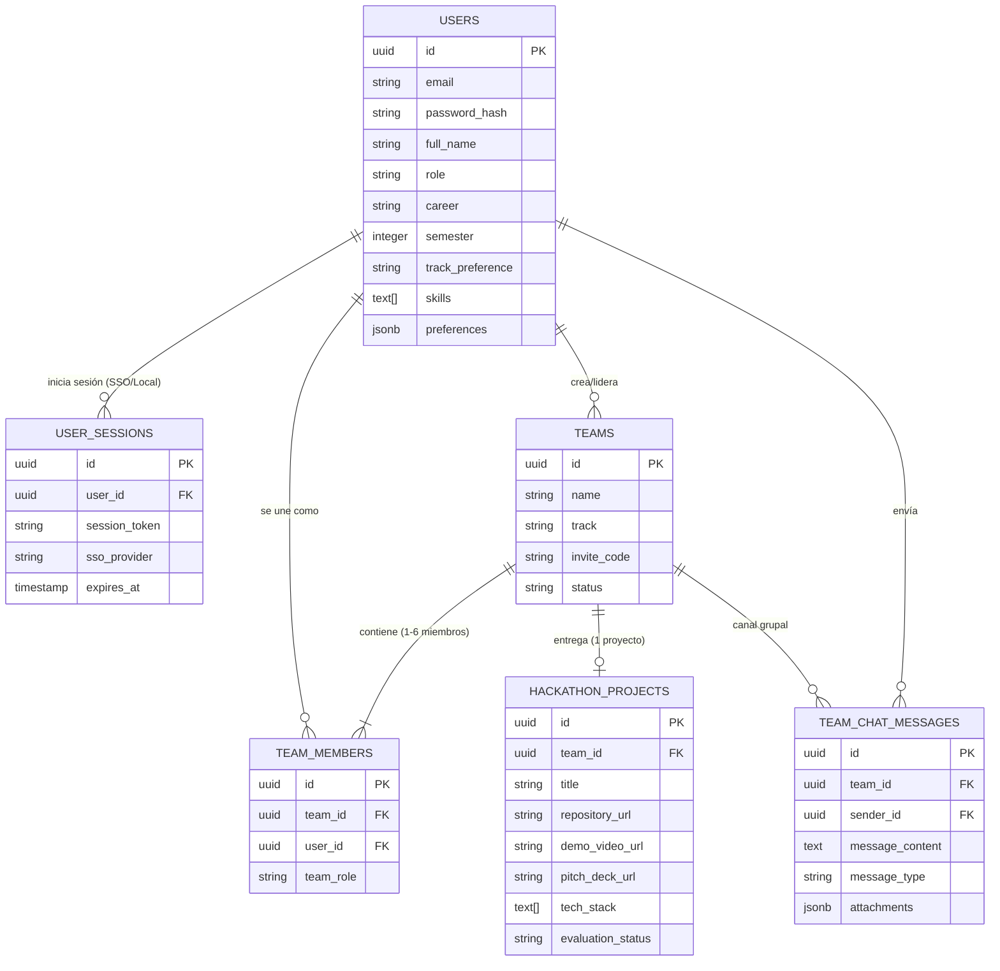

# Arquitectura de Base de Datos · Semana DIE 2026

Esquema SQL relacional compatible con **PostgreSQL 15+** y **Supabase** para gestionar la plataforma interactiva de **Semana DIE 2026** (Facultad de Ingeniería UNAM).

---

## 📐 Diagrama Entidad-Relación (ERD)



---

## 🗂️ Descripción de Tablas

### 1. `users` (Cuentas institucionales y perfiles)
Almacena la identidad de estudiantes, investigadores, mentores, jueces y patrocinadores.
* **Campos clave**: `email`, `role`, `career`, `semester`, `skills` (arreglo de tecnologías: `['Python', 'C++', 'ROS']`).
* **JSONB `preferences`**: Almacena configuración visual (tema oscuro/claro), notificaciones y preferencias de privacidad sin requerir migraciones adicionales.

### 2. `user_sessions` (Autenticación y SSO FI UNAM)
Administra sesiones activas y tokens de acceso.
* Compatible con autenticación federada (**SSO Facultad de Ingeniería UNAM** / OAuth).

### 3. `teams` (Equipos del Hackathon)
Registro de equipos participantes.
* **Campos clave**: `name`, `track`, `invite_code` (código único para invitar compañeros), `status` (`recruiting`, `full`, `submitted`).

### 4. `team_members` (Miembros de Equipo)
Tabla intermedia N:M con restricción única `(team_id, user_id)`.
* Define roles dentro del equipo: `leader`, `hardware_lead`, `software_lead`, `member`, `mentor`.

### 5. `hackathon_projects` (Entrega de Proyectos)
Almacena el entregable oficial por equipo (`team_id UNIQUE`).
* Contiene URLs al repositorio de GitHub (`repository_url`), video demo (`demo_video_url`), diapositivas pitch (`pitch_deck_url`) y diagramas/esquemáticos PCB (`schematics_url`).

### 6. `team_chat_messages` (Chat Grupal en Tiempo Real)
Canal privado de mensajería para coordinación interna del equipo.
* Soporta mensajes de texto, bloques de código, anuncios oficiales y archivos adjuntos en `attachments` (JSONB).

### 7. `sponsorship_leads` (Prospectos de Patrocinio)
Almacena las solicitudes enviadas por empresas desde la sección de **Aportaciones y Patrocinios**.

---

## 🚀 Ejecutar la Migración

Para aplicar este esquema en tu base de datos **PostgreSQL** o proyecto de **Supabase**:

```bash
psql -U postgres -d semana_die_db -f database/01_semana_die_schema.sql
```
